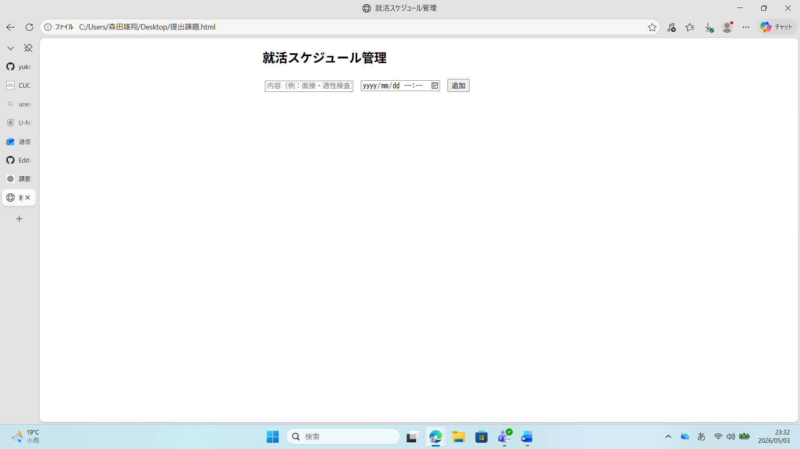

# 就活スケジュール管理アプリ

## 概要
就活のタスク（面接・適性検査など）を管理するシンプルなアプリです。

## 機能
- タスク追加
- 締切設定
- 残り時間表示
- 削除機能

## 使用技術
- HTML
- CSS
- JavaScript

## 動作方法
index.html をブラウザで開くことで動作します。

## 動作イメージ

## 工夫した点
締切までの残り時間を自動で計算して表示するようにしました。

## 改善点
データの保存機能（localStorage）を今後追加予定です。

### ■ 何を作ろうと思ったか
就職活動における面接や適性検査などのスケジュールを管理できるシンプルなWebアプリを作成しました。

### ■ なぜ作ろうと思ったか
就職活動では複数の企業の選考が並行して進むため、スケジュール管理が煩雑になりやすいと感じました。  
そのため、締切や予定を簡単に管理できるツールがあれば便利だと考え、このアプリを作成しました。

### ■ 生成AIとのやり取り
今回の制作では、生成AIを活用して基本的な構造の整理やコードの改善を行いました。

特に以下の点で活用しました：
- JavaScriptでのタスク追加・削除機能の実装方法
- 残り時間の計算ロジックの考え方
- コードのシンプル化や可読性の向上

また、単にコードを生成するだけでなく、
「なぜその実装になるのか」を意識して質問することで理解を深めるよう工夫しました。

### ■ 詰まったところとどう乗り越えたか
タスクの締切から残り時間を計算する処理の実装に苦戦しました。  
特に、日付データの扱いと現在時刻との差分の計算で混乱しました。

この問題については、生成AIに質問しながら処理の流れを分解して理解することで解決しました。  
また、実際にコンソールで値を確認しながら動作を検証することで理解を深めました。

### ■ 次にやるなら何を変えるか
今回のアプリはページを更新するとデータが消えてしまうため、  
次回は localStorage などを活用してデータを保存できるように改善したいと考えています。

また、UIの見やすさや操作性も向上させ、より実用的なアプリにしたいです。
